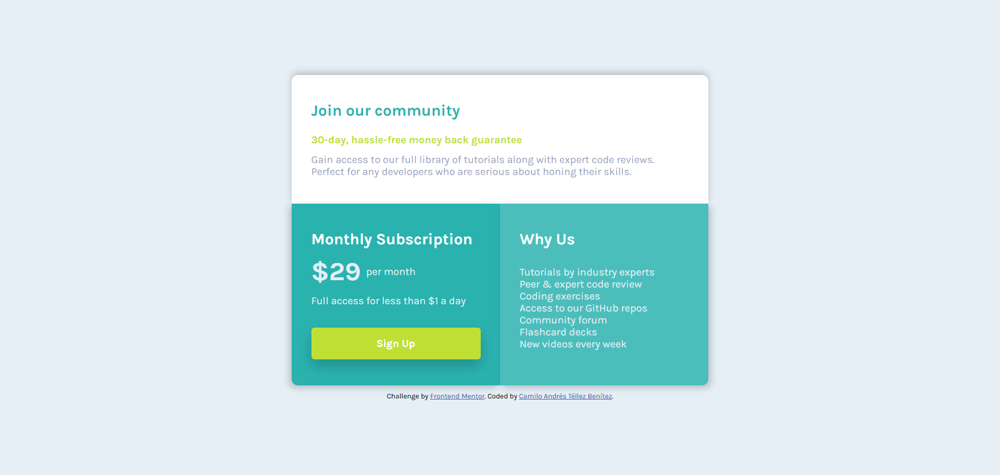

# Frontend Mentor - Solución al reto "Single Price Grid Component"

Esta es mi solución al reto [Single Price Grid Component en Frontend Mentor](https://www.frontendmentor.io/challenges/single-price-grid-component-5ce41129d0ff452fec5abbbc). Este tipo de desafíos me ayuda a mejorar mis habilidades en desarrollo web al construir proyectos con diseños realistas.

## Índice

- [Descripción](#descripción)
- [Desafío](#desafío)
- [Captura de pantalla](#captura-de-pantalla)
- [Enlace al proyecto](#enlace-al-proyecto)
- [Proceso de desarrollo](#proceso-de-desarrollo)
  - [Tecnologías utilizadas](#tecnologías-utilizadas)
- [Sobre mí](#sobre-mí)

## Descripción

### Desafío

El objetivo de este reto era lograr que los usuarios pudieran:

- Visualizar un diseño óptimo del sitio según el tamaño de la pantalla del dispositivo.

### Captura de pantalla

Aquí muestro el resultado del proyecto en una pantalla de escritorio:

### Enlace al proyecto

- URL del proyecto publicado: [Aquí estará el enlace del sitio en GitHub Pages](https://camilo-atb.github.io/Single-Price-Grid-Component/)

## Proceso de desarrollo

### Tecnologías utilizadas

En este proyecto utilicé:

- **HTML5 semántico** para asegurar una estructura clara y accesible.
- **CSS Grid** para organizar los elementos de forma flexible y responsiva.
- **Propiedades personalizadas de CSS** para mantener consistencia en los estilos.
- **Enfoque mobile-first**, garantizando una experiencia óptima en dispositivos móviles.

## Sobre mí

- **LinkedIn** - [Camilo Andrés Téllez Benítez](http://www.linkedin.com/in/camilo-téllez)
- **Frontend Mentor** - [@camilo-atb](https://www.frontendmentor.io/profile/camilo-atb)
- **YouTube** - [Camilo Téllez](https://www.youtube.com/@camilotellez887)

